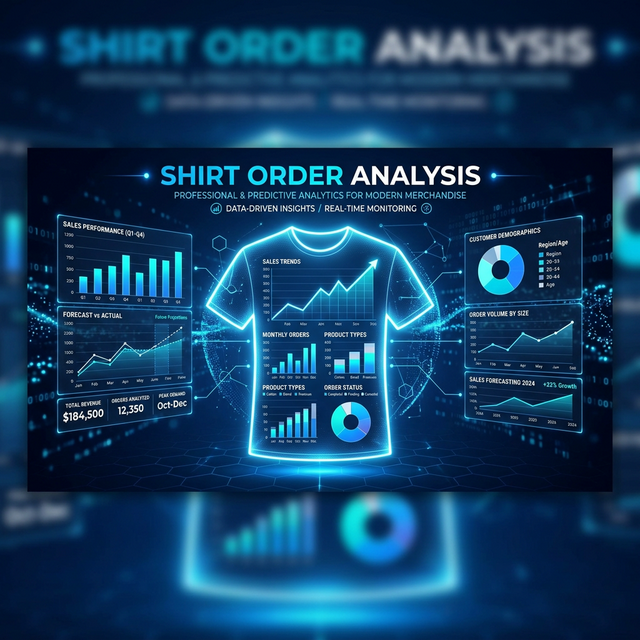
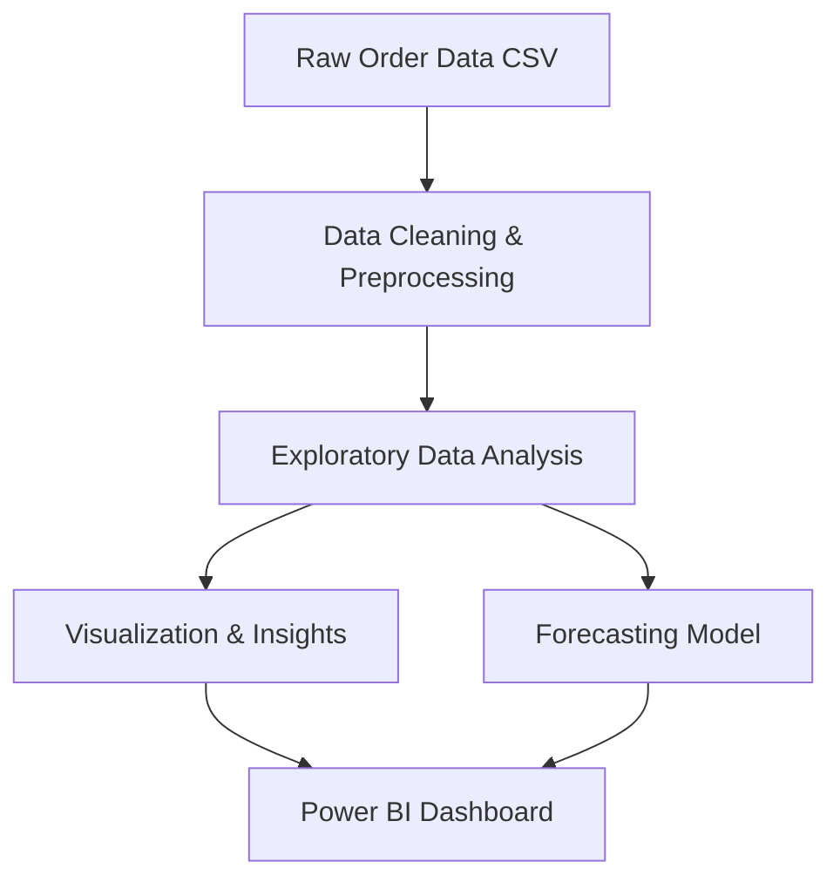

# 👕 Shirt Order Analysis



> A comprehensive data analysis and forecasting project for shirt orders, combining the power of **Python**, **Power BI**, and modern data science techniques.

---

## 📌 Overview

This project performs end-to-end analysis of shirt order data — from raw sales records to interactive dashboards and machine learning forecasting models. It helps businesses understand their sales trends, customer behavior, and predict future order volumes.

---

## 🚀 Features

- 📊 **Exploratory Data Analysis (EDA)** — In-depth analysis of shirt orders including trends, seasonality, and top-selling products.
- 🤖 **Forecasting Model** — Machine learning model to predict future shirt orders (including week-ahead forecasting).
- 📈 **Power BI Dashboard** — Interactive visual dashboard (`Final Dashboard.pbix`) for business stakeholders.
- 🗄️ **Database Integration** — Microsoft Access database (`Contoso sales dashboard.mdb`) for structured data storage.
- 🧹 **Data Cleaning & Preprocessing** — Clean, normalized datasets ready for analysis.

---

## 🗂️ Project Structure

```
shirt-order-analysis/
│
├── Shirt_orders_analysis(python-power BI-github)/
│   ├── Shirt_orders_analysis.ipynb              # Main EDA notebook
│   ├── Shirt_order_forecasting_model.ipynb      # Forecasting model (v1)
│   ├── Shirt_order_forecasting_model +week 4.ipynb  # Forecasting model with week 4
│   ├── Final Dashboard.pbix                     # Power BI dashboard
│   ├── Contoso sales dashboard.mdb              # Access database
│   ├── ORDERS.csv                               # Raw orders data
│   ├── Products.csv                             # Products reference data
│   ├── customers.csv                            # Customers data
│   ├── Short_order_dataset_final.csv            # Final cleaned dataset
│   ├── New XLSX Worksheet.xlsx                  # Additional spreadsheet data
│   └── Shirt Dashboard.png                      # Dashboard screenshot
│
├── banner.png                                   # Project banner
└── README.md                                    # Project documentation
```

---

## 🛠️ Tech Stack

| Tool | Purpose |
|------|---------|
| 🐍 **Python** | Data analysis, cleaning & ML forecasting |
| 📓 **Jupyter Notebook** | Interactive data exploration |
| 📊 **Power BI** | Business intelligence dashboards |
| 🗄️ **Microsoft Access** | Relational data storage |
| 📁 **CSV / Excel** | Raw data sources |

---

## 📦 Python Libraries Used

```python
import pandas as pd          # Data manipulation
import numpy as np           # Numerical computing
import matplotlib.pyplot as plt  # Visualization
import seaborn as sns        # Statistical plots
# + Forecasting/ML libraries
```

---

## 📊 Dashboard Preview

/Shirt%20Dashboard.png)

---

## ⚡ Getting Started

### Prerequisites

- Python 3.8+
- Jupyter Notebook or JupyterLab
- Power BI Desktop (for `.pbix` file)

### Installation

1. **Clone the repository**
   ```bash
   git clone https://github.com/kirollos2001/shirt-order-analysis.git
   cd shirt-order-analysis
   ```

2. **Install required Python packages**
   ```bash
   pip install pandas numpy matplotlib seaborn scikit-learn openpyxl
   ```

3. **Launch Jupyter Notebook**
   ```bash
   jupyter notebook
   ```

4. **Open the analysis notebooks** in the `Shirt_orders_analysis(python-power BI-github)/` folder.

---

## 📈 Analysis Workflow



---

## 🔍 Key Insights

- 📦 Order volume trends across different time periods
- 🎨 Best-selling shirt types, colors, and sizes
- 👥 Customer segmentation and buying patterns
- 📅 Seasonal demand forecasting for inventory planning

---

## 🤝 Contributing

Contributions are welcome! Feel free to open an issue or submit a pull request.

1. Fork the project
2. Create your feature branch (`git checkout -b feature/AmazingFeature`)
3. Commit your changes (`git commit -m 'Add some AmazingFeature'`)
4. Push to the branch (`git push origin feature/AmazingFeature`)
5. Open a Pull Request

---

## 📄 License

This project is open source and available under the [MIT License](LICENSE).

---

## 👤 Author

**Kirollos**  
GitHub: [@kirollos2001](https://github.com/kirollos2001)

---

<p align="center">
  Made with ❤️ and data science
</p>
